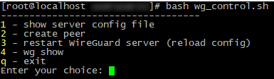
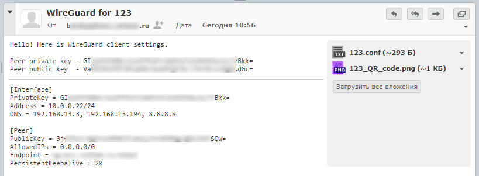

# wg_control
*Bash script to easy create WireGuard peer with e-mail notification*

## Tested on
- [CentOS](https://www.centos.org/) Linux 7
- [WireGuard](https://www.wireguard.com/)
- [curl](https://curl.se/) 7.84.0 (for e-mail with TLSv1.2)
- [bash](https://www.gnu.org/software/bash/) 4.2.46(2)-release

## Features
- create new peer in few steps
- e-mail configuration and created files to client (private & public client keys, configuration file, QR code in PNG)